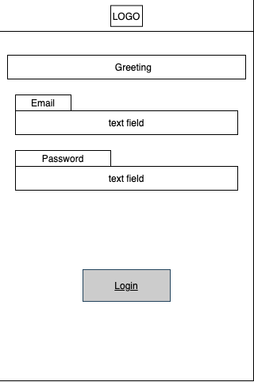
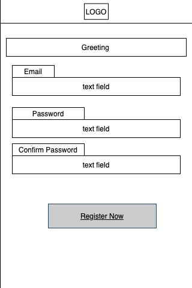
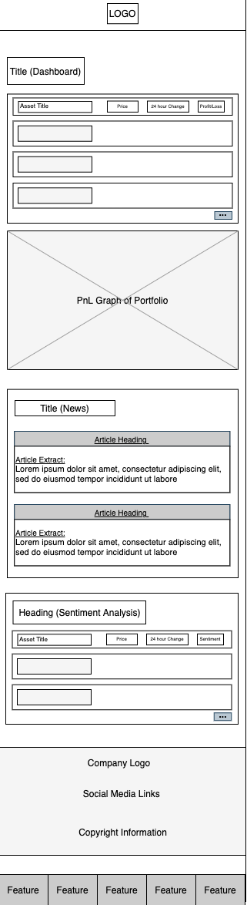
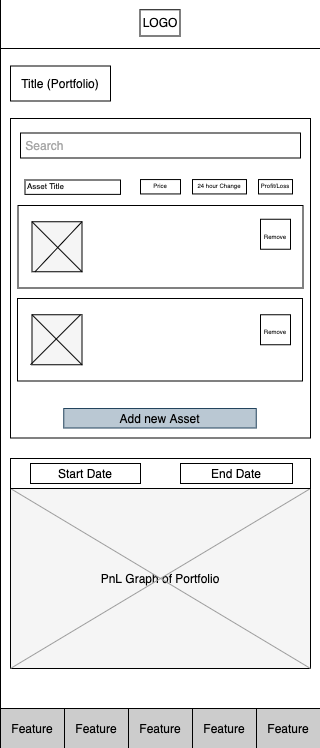
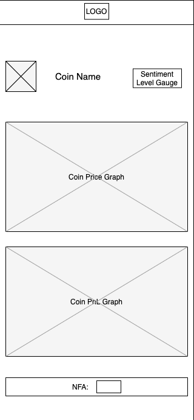
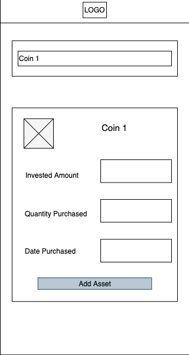
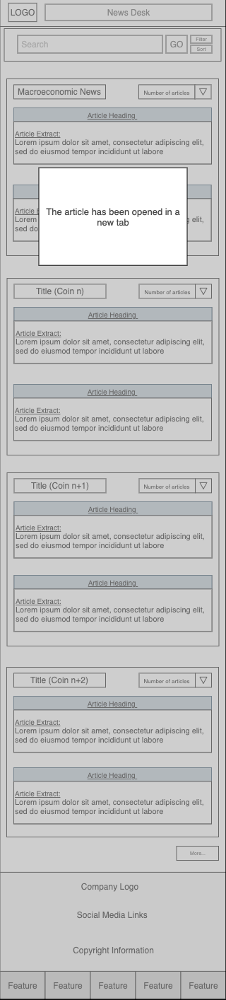
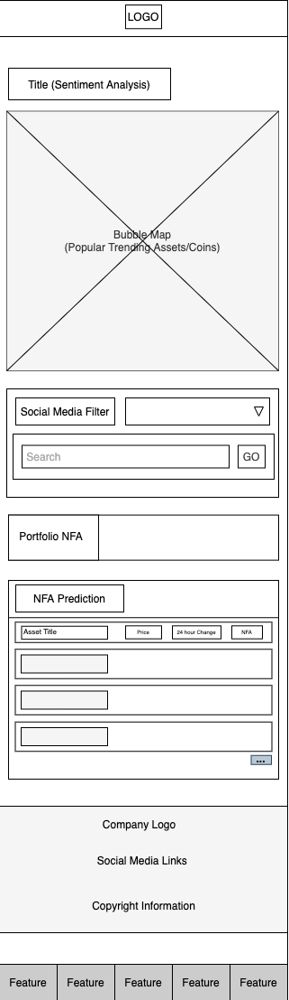
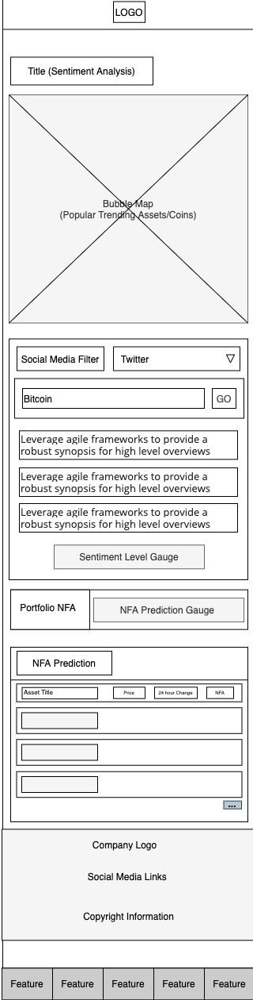
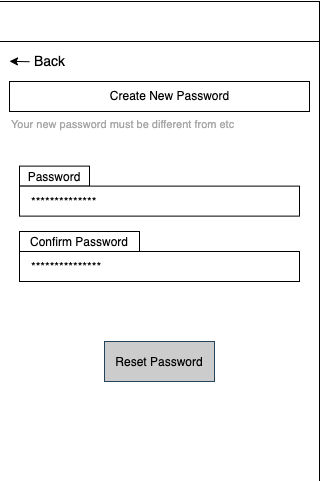

## User Experience Design

This repository contains instructions and files for two assignments that together comprise the user experience design phase of a web app.

Replace the contents of this file with the completed assignments, as described in:

- [app map and wireframe instructions](./instructions-app-map-wireframe.md).
- [prototype instructions](./instructions-prototype.md)

# Dyor

## App Map

## Wireframes

 

### Landing Page

 

### User Login/Signup

#### Login routine

#### Signup routine

 

### Dashboard

 

### User Portfolio

#### Displays current User Portfolio

#### When adding a new Asset to the Portfolio

 

### News

 

### NFA / Sentiment Analysis

 

### Settings

 
