## User Experience Design

This repository contains instructions and files for two assignments that together comprise the user experience design phase of a web app.

Replace the contents of this file with the completed assignments, as described in:

- [app map and wireframe instructions](./ux-design/instructions-app-map-wireframe.md).
- [prototype instructions](./ux-design/instructions-prototype.md)

# Dyor

## Prototype

[Link to our Prototype](https://invis.io/UW11VJTZCY9D)

 

## App Map

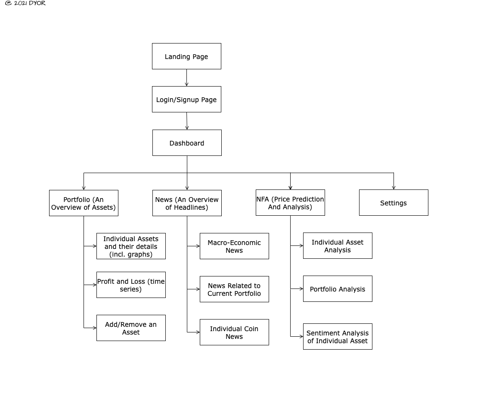

## Wireframes

 

### Landing Page

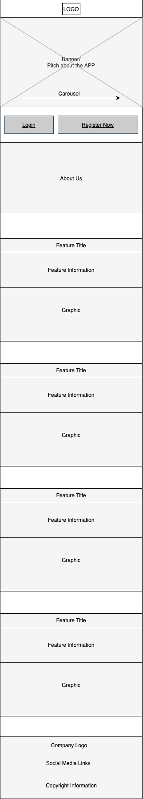

 

### User Login/Signup

#### Login routine

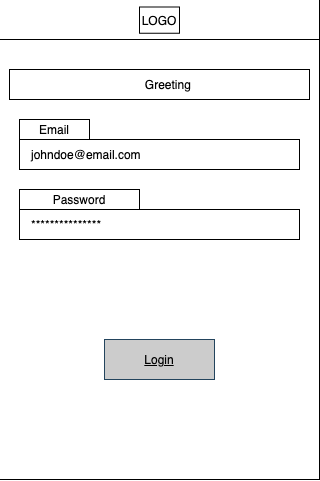

#### Signup routine

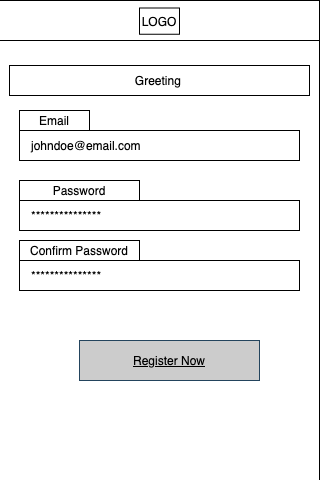

 

### Dashboard

 

### User Portfolio

#### Displays current User Portfolio

#### When adding a new Asset to the Portfolio

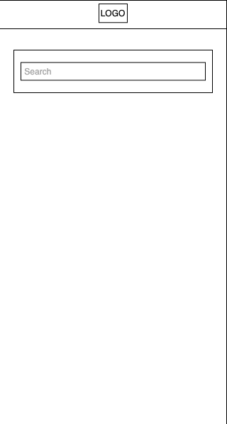
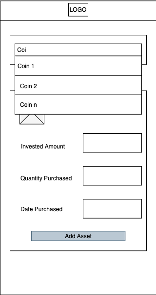

 

### News

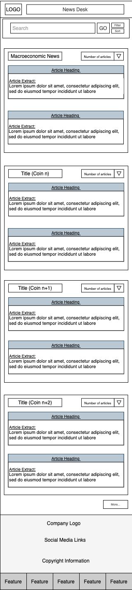

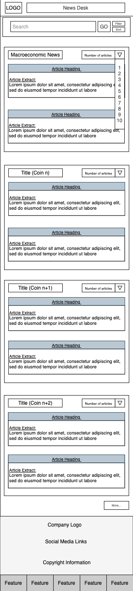

 

### NFA / Sentiment Analysis

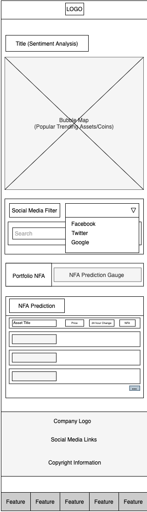
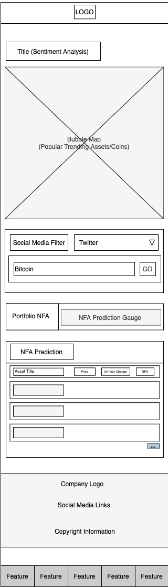

 

### Settings

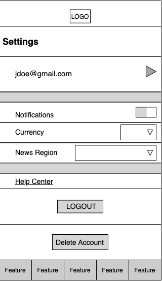

 
